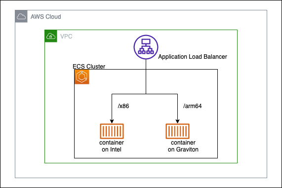

# ECS Fargate on Graviton and Intel



Run containers from the same image (multi architecture image) on both Graviton and Intel.

## Getting started

### Requirements

- AWS account with cdk bootstrap
- AWS Region: us-east-1
- AWS CLI
- Docker 
- Docker Buildx
- Npm

### Clone the repository and install cdk

```shell
git clone https://github.com/hkford/ecs-fargate-on-graviton-intel.git
cd /ecs-fargate-on-graviton-intel
npm install
```

### Deploy `InfrastructureStack`
Run the following command. Press `y` to the question `Do you wish to deploy these changes (y/n)?`.

```shell
npx cdk deploy ECSInfrastructureStack
```

### Build and push a multi architecture container image
The application code and Dockerfile is in the `app` directory.

```shell
cd app
```

First run `docker login` for authentication. Run the command printed on the terminal `ECSInfrastructureStack.DockerLoginCommand`.

```shell
aws ecr get-login-password --region us-east-1 | docker login --username AWS --password-stdin ${account id}.dkr.ecr.us-east-1.amazonaws.com

WARNING! Your password will be stored unencrypted in /home/ec2-user/.docker/config.json.
Configure a credential helper to remove this warning. See
https://docs.docker.com/engine/reference/commandline/login/#credentials-store

Login Succeeded
```

Then build and push a multi architecture container image using Docker Buildx plugin. Run the command printed on the terminal `ECSInfrastructureStack.DockerBuildxPushCommand`. It takes longer time (370s in my x86 environment) to build an image for arm64 than for x86.

```shell
docker buildx build --platform linux/arm64,linux/amd64 --tag ${ECR repository URI}:v1 --push .
```

Let's check if application server can handle requests locally. Run the command printed on the terminal `ECSInfrastructureStack.DockerRunCommand`. 

```shell
docker run --init -p 3000:3000 --rm {ECR repository URI}:v1
curl http://localhost:3000/
```

### Deploy `EcsServiceStack`
Run the following command. Press `y` to the question `Do you wish to deploy these changes (y/n)?`.

```shell
npx cdk deploy ECSServiceStack
```

### Access application server via load balancer
Application server is running both on Graviton(Arm64) and Intel(X86). Let's see both application.

The endpoint for application server on arm64 is printed on the terminal `ECSInfrastructureStack.AccessALBArm64` and one for x86 is on the terminal `ECSInfrastructureStack.AccessALBX86`.

```shell
curl ${AccessALBArm64}
curl ${AccessALBX86}
```


### Delete entire stack
Run the following command to delete two stacks. Press `y` to the question `Are you sure you want to delete: ECSServiceStack, ECSInfrastructureStack (y/n)?`.

```shell
npx cdk destroy "*"
```